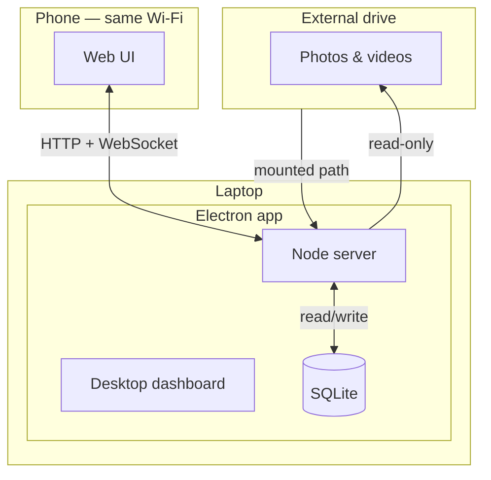

# Pictinder

Tinder for pictures. Swipe to shortlist photos/videos from local folders (e.g. an external drive) without moving or deleting originals.

## Why

Large media libraries (10k+ wedding/event photos, RAW + JPEG + video) are painful to cull. Pictinder lets you review on your phone via swipe while media stays on the laptop's disk. Multiple people can review simultaneously. The result is a clean shortlist ready to export.

## How it works

1. **Desktop app** (Electron, macOS/Windows) — add media folders, start the embedded server, get a QR code.
2. **Phone** (any browser, same Wi-Fi) — scan QR, join or create an album, swipe right to keep / left to skip.
3. **Album detail** — grid view for reclassification, metadata inspection, and export.

Originals are never deleted, moved, or overwritten. All state lives in a local SQLite database.

## Features

### Collaboration
- **Shared mode** — all devices see the same items; votes are aggregated.
- **Distributed mode** — items are split across devices automatically; faster swipers get more work.

### Media handling
- Recursive folder scan with support for JPEG, PNG, HEIC/HEIF, RAW (NEF, ARW, CR2, CR3, DNG, RAF, ORF, RW2, PEF), GIF, WebP, MP4, MOV, AVI, WebM, MKV.
- RAW/HEIC preview extraction (ExifTool, sips, ffmpeg fallback).
- Video thumbnails and browser-compatible transcoding (.mov/.avi/.mkv to H.264 MP4).
- Rotation (Sharp for images, ffmpeg for video), cached per album.
- EXIF metadata display (date, location, camera, dimensions, duration).
- Previews, thumbnails, and transcodes cached in `pictinder-data/`.

### Phone UI
- Full-screen swipe cards with touch gestures and keyboard arrows.
- Preloads next 10 images for instant transitions.
- Undo, rotate, reveal in Finder, open file, share/download.
- Filter feed by file type or subfolder.
- Album explorer to switch or manage albums.

### Album detail
- Infinite-scroll grid with filter tabs (All / Selected / Discarded / Unswiped).
- Full-size preview overlay with metadata and per-device vote chips.
- Reclassify, rotate, reveal, open, share, copy path.
- Desktop: double-click to open, right-click to reveal. Touch: long-press action sheet.

### Desktop dashboard
- Add/remove media folders, configure port, start/stop server.
- QR code + join URL with rotating tokens.
- Live device list (online/offline, current album).
- Album list with progress stats; create/delete albums.
- Activity log, cache stats, clear cache.
- Cloud upload notifications with resume/snooze/dismiss.

### Cloud export (Google Drive)
- Connect multiple Google accounts via OAuth.
- Upload strategies: **duplicate** (all accounts) or **distribute** (by free space).
- Scope: all items or selected only.
- Pause, resume, cancel, retry failed uploads.
- Per-album Drive folder links.

### Persistence
- SQLite (albums, items, choices, progress, cloud state).
- electron-store for folders, port, OAuth credentials.
- localStorage on phone for device ID and feed filters.

## Architecture



## Running

**From the app:** open Pictinder, add a media folder, click **Start server**, scan the QR code on your phone.

**From source:**

```bash
npm install
npm start            # dev
npm run build:mac    # macOS .dmg
npm run build:win    # Windows installer
```
