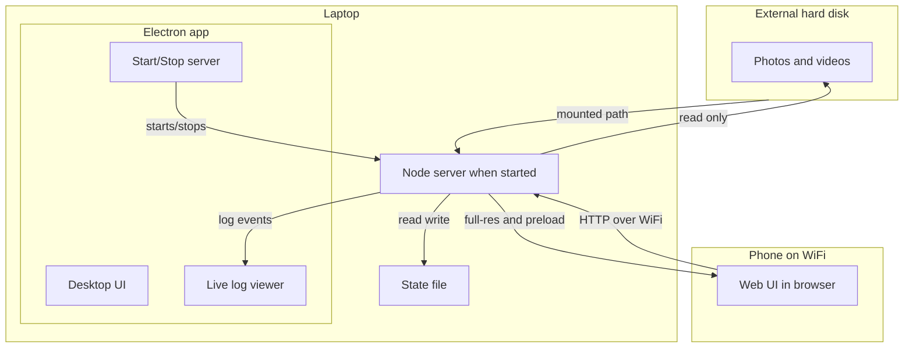

# Pictinder

**Pictinder** — Tinder for pictures: shortlist photos/videos from a folder hierarchy on disk (e.g. external hard disk) by swiping, without moving or deleting files.

## Goals

- Shortlist media from a **local folder hierarchy** (e.g. 10k+ wedding photos/videos on an external hard disk).
- Build a **subfolder or list of "selected" paths** so you can later copy only those files for sharing — no in-app deletion or moving of originals.
- **Read-only over the source**: all operations are view + "mark as selected/rejected"; no line of code may delete, move, or overwrite any file.

## Motivation

- Large post-wedding libraries (10k+ items), mix of RAW (e.g. 50MB+), JPEG, and MP4.
- Need to review on a **phone-friendly UI** (swipe) while media stays on **hard disk plugged into laptop** (no bulk copy to laptop for review).
- Result: a shortlist (e.g. paths or a subfolder) to copy only chosen files for sharing.

## Tech stack

- **Electron** desktop app: one codebase, builds as `.app` (Mac) and `.exe` (Windows)—easy to run or ship to photographers on either OS. No file deletion anywhere.
- **Node.js** (embedded in Electron): local server runs inside the app when you click **Start server**; serves the phone web UI, media, and API for swipe state. No separate install.
- **Phone**: browser opens the URL shown in the app; same WiFi. The desktop window shows a **live log** of swipe and connection events from the phone (Apple-like UI: clean, minimal, server toggle, scrollable log).

## Architecture

- **Desktop (Electron)**: Runs on the laptop; you pick the media root (e.g. external drive) and start the embedded server from the UI; live log shows phone actions in real time.
- **Embedded server (Node)**: Only runs when **Start server** is active; serves API and static assets; reads from media path, writes state file; streams log events to the desktop window.
- **Phone**: Connects over **local WiFi**; opens the web UI in browser. All file reads go through the laptop; phone never touches disk.
- **Media path**: Server **recursively scans** the chosen top-level folder (and all subfolders) for media (e.g. `/Volumes/...` or `D:\...`). The **currently viewed** image is served at full resolution (no downscaling). The site **pre-downloads the next 10 images** in the queue so when you swipe to them they are already loaded; thumbnails or proxies only for items further ahead if needed.
- **Persistence**: Swipe decisions stored in a **text or metadata file on the laptop** (e.g. JSON/CSV). Next session resumes from last position; no deletion of media.

## Implementation

- **Backend (laptop)**: Scan folder hierarchy from a configurable root path; serve list of media paths; serve **full-resolution** for the current item; optionally thumbnails/proxies for items further in queue; read/write **state file** (e.g. `choices.json` or `progress.txt`) with swipe outcomes and "last index" or "last path".
- **Frontend (phone)**: Tinder-like swipe UI; **pre-download next 10 images** in queue so the current one is full-res and upcoming ones are ready when the user reaches them; **once an image is swiped on, discard its local copy** (blob/cache) so the browser tab does not grow in size indefinitely; right = selected, left = not selected (or vice versa); each action sends only an update to backend to append to state; no delete/move/trash of **files** in UI or API.
- **Invariants**: (1) **No deletion of files**: no code path may delete, move, or overwrite any photo/video on disk; (2) the frontend may release in-browser copies (blobs, cached image data) after swipe to limit tab memory; (3) state file is append/update only for *metadata*; (4) "selected" is stored as a list of paths or IDs; creating a "subfolder" later is a separate copy step (e.g. script or export), not part of core app.

## Running

**From the app:** Open Pictinder on your laptop, choose the media folder (e.g. your external drive), click **Start server**, then on your phone open the URL shown in the app (or scan the QR code) over the same WiFi. The desktop window shows a live log of swipe and connection events from the phone.

**From source:** `npm install` then `npm start`. Build for Mac: `npm run build:mac`. Build for Windows: `npm run build:win`.
